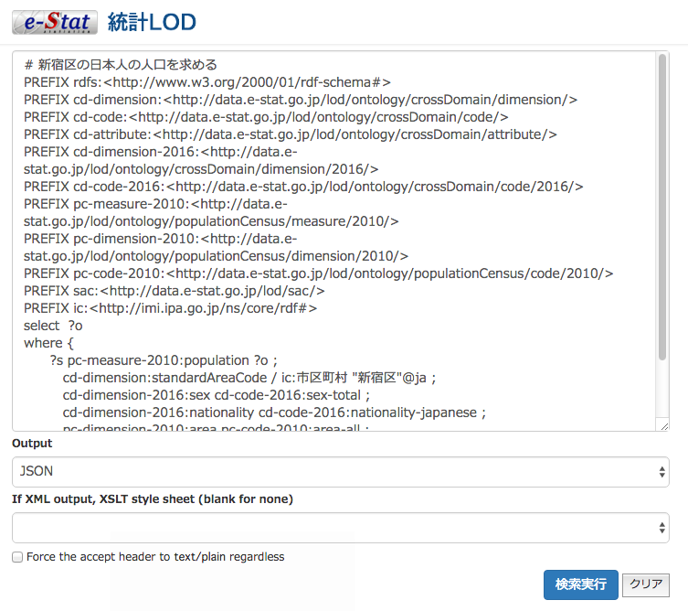

# 統計LODを使う為の最低限の知識

## 統計LOD Webサイト

[統計LODトップ](http://data.e-stat.go.jp/lodw/)

[SPARQL Query Editor](http://data.e-stat.go.jp/lod/sparql/)

## 便利なツール

[統計LODサポート](http://idease.info/lodstat/)
キーワード検索で関連するデータのプロパティ一覧を検索できます。すごく便利。

[e-STAT SPARQL Builder](http://www.kanzaki.com/works/2016/pub/estat.html)
データセットを選ぶと速度、次元などのデータキューブがオプションとして選択できるようになり
SPARQLに反映されます。統計LODのスキーマがどんな感じなのか知るツールとして、触っても良いかも。

## 取得できるデータ

- H22国政調査、H26人口推計:
- H26住民基本台帳人口移動報告:
- H26経済センサス-基礎調査、:
- H24〜労働力調査:
- H22消費者物価指数:
- H27社会・人口統計体系:

### データセットのプロパティ

## プロパティ

### プロパティ一覧

## エンドポイント

- ブラウザで取得で試すには

[SPARQL Query Editor](http://data.e-stat.go.jp/lod/sparql/)

- 統計LODを外部アプリケーションで利用するためのSPARQLエンドポイント

[http://data.e-stat.go.jp/lod/sparql/query?query=]( http://data.e-stat.go.jp/lod/sparql/query?query=)

## 統計LODのSPARQL

○○の○○を取得するサンプル

### 統計LODのプレフィックス

## 参考

[notebookのプレビュー](http://nbviewer.jupyter.org/github/dogrunjp/hello_estat_lod/blob/master/index.ipynb)

